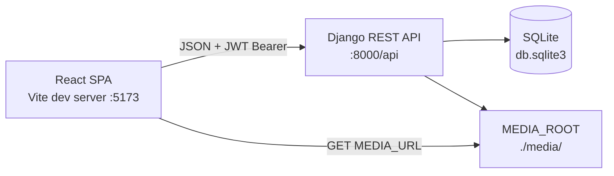
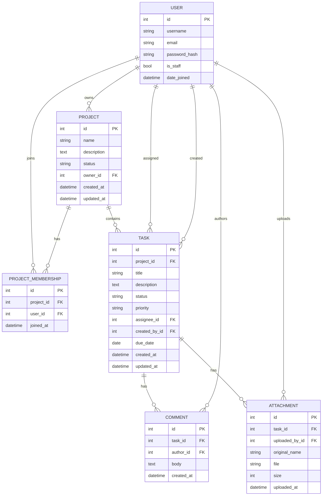
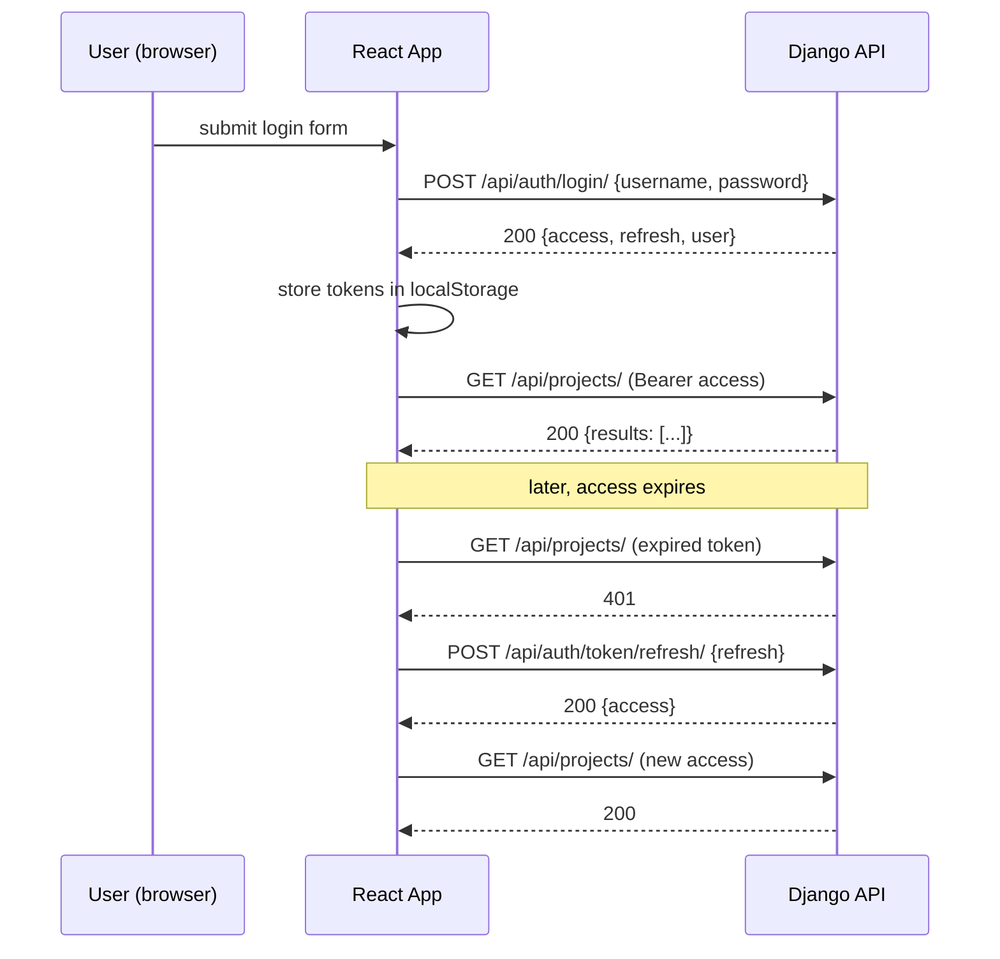

# QAA Training Application — Architectural Plan

## 1. Problem Analysis

### Goal
Build a Project Manager web application explicitly designed as a training target for QA Automation students. The PRIMARY design driver is **testability**, not production quality: the app must expose a wide variety of API contracts, UI flows, edge cases, validation errors, authorization scenarios, and stable selectors so students can practice both API-level and UI-level automated testing.

### Constraints
- Backend: Python 3.11+, Django 5.x, Django REST Framework, SQLite
- Auth: JWT via `djangorestframework-simplejwt`
- Frontend: React 18+ via Vite, plain JavaScript (no TypeScript to keep it simple)
- Database: SQLite (zero setup)
- Code must be **clear and readable**, not over-engineered — students should be able to read and understand it
- All forms and interactive elements must carry stable test selectors (`id`, `name`, `data-testid`)
- Must return correct HTTP status codes (400, 401, 403, 404) — these are the contract students will test against

### Non-Goals
- Production-grade security hardening
- Real-time features (WebSockets, push)
- Complex permission matrices beyond owner/member/admin
- Email sending, background jobs, caching layers

### What the application must do (functional)
Two roles (regular user, admin), JWT-authenticated CRUD over Projects, Tasks, Comments, Attachments and Project Members; filters, pagination, global search; all endpoints listed in the brief returning correct status codes.

---

## 2. Architectural Decision Record (ADR)

### ADR-1: Backend layout — multiple Django apps by domain
- **Context**: We need a Django project that is easy to navigate and read by students.
- **Options**:
  - A. Single monolithic app `core` containing everything — pros: fewer files; cons: poor separation, students cannot easily see boundaries between domains.
  - B. Multiple small apps split by domain (`accounts`, `projects`, `tasks`, `comments`, `attachments`, `search`) — pros: clear boundaries, each app has its own models/serializers/views/urls, mirrors real production layouts students will encounter; cons: slightly more files.
- **Decision**: Option B — split into apps by domain.
- **Justification**: Training material benefits from clear separation. Each app is small (1 model, 1 serializer file, 1 viewset). Demonstrates the standard Django convention students will see in real jobs.
- **SOLID**: SRP — each app owns one domain concept.

### ADR-2: API style — DRF `ModelViewSet` + nested routers where natural
- **Context**: Brief specifies both flat (`/api/tasks/{id}/`) and nested (`/api/projects/{id}/tasks/`) URL patterns.
- **Options**:
  - A. Pure flat URLs with query params — pros: simpler routing; cons: doesn't match the brief.
  - B. Mix: nested routes for "list/create within a parent" (collection actions) and flat routes for "single resource by id" (item actions). Implemented with `drf-nested-routers`.
- **Decision**: Option B.
- **Justification**: Matches the brief exactly. Teaches students to deal with both URL styles.
- **SOLID**: ISP — separate resources have separate, focused endpoints.

### ADR-3: Permissions — DRF permission classes per viewset
- **Context**: Need to enforce: only owner can edit/delete a project; only project members can see tasks; admins can do anything.
- **Options**:
  - A. Inline `if request.user == ...` checks in views — pros: explicit; cons: duplicated, not testable in isolation.
  - B. Custom `BasePermission` classes (`IsProjectOwner`, `IsProjectMember`, `IsCommentAuthorOrAdmin`) plugged into viewsets via `permission_classes` and `get_permissions()`.
- **Decision**: Option B.
- **Justification**: Single source of truth for each authorization rule. Returns 403 automatically. Easy to test.
- **SOLID**: SRP + OCP — each rule is one class; new rules added without modifying viewsets.

### ADR-4: Frontend — feature-folder structure with thin API layer
- **Context**: React app needs to be readable and offer many UI surfaces to test.
- **Options**:
  - A. Flat `src/components/` + `src/pages/` — pros: simple; cons: breaks down as features grow.
  - B. Feature folders (`src/features/projects`, `src/features/tasks`, ...) each containing pages + components, plus a shared `src/api/` layer wrapping axios + JWT.
- **Decision**: Option B.
- **Justification**: Mirrors the backend split, easy for students to map UI to API. Centralized axios instance handles JWT attachment and 401 → refresh.
- **SOLID**: SRP — API layer separated from view layer; DIP — pages depend on API service abstractions, not raw axios.

### ADR-5: Auth storage — `localStorage` for tokens
- **Context**: Must be JWT, must work for UI tests. Real production would prefer httpOnly cookies, but that complicates Selenium/Cypress test setup.
- **Decision**: Store `access` + `refresh` in `localStorage`. Axios interceptor attaches `Authorization: Bearer ...` and refreshes on 401.
- **Justification**: Simplifies test setup — students can seed tokens directly in `localStorage` to bypass UI login when needed.
- **Trade-off**: Not production-secure, but acceptable and explicitly noted in README as a training-only choice.

### ADR-6: File uploads — Django `MEDIA_ROOT` on disk
- **Context**: Attachments must be uploadable and downloadable.
- **Decision**: Use Django's `FileField` with local `MEDIA_ROOT`. Serve via Django dev server `MEDIA_URL`.
- **Justification**: Simplest possible; SQLite + local files keeps "zero setup" promise.

### ADR-7: Search — single endpoint with naive ORM `Q` lookups
- **Context**: Global search across projects, tasks, comments.
- **Decision**: Single view that runs `Q(name__icontains=q) | Q(description__icontains=q)` queries across the three models and returns a structured result `{"projects": [...], "tasks": [...], "comments": [...]}`.
- **Justification**: No external search engine needed; behavior is deterministic and easy to assert against in tests.

---

## 3. Implementation Plan

The plan is split into **functional slices**. Each step is small (≤5 files), independently testable, and leaves the system in a working state.

### Phase 1 — Backend foundation

**Step 1.1 — Django project skeleton + settings**
- Create `backend/` directory with `manage.py` and `config/` package (`settings.py`, `urls.py`, `wsgi.py`, `asgi.py`).
- Configure: SQLite, `INSTALLED_APPS` (rest_framework, simplejwt, corsheaders, drf_nested_routers, our apps placeholder), `REST_FRAMEWORK` defaults (JWT auth, pagination = `PageNumberPagination` size 10), `CORS_ALLOWED_ORIGINS`, `MEDIA_ROOT/URL`.
- Files: `backend/manage.py`, `backend/config/{__init__,settings,urls,wsgi,asgi}.py`, `backend/requirements.txt`.
- Deliverable: `python manage.py runserver` boots; `/admin/` reachable.

**Step 1.2 — `accounts` app: User model + auth endpoints**
- Use Django default `User` for simplicity; add `is_admin` via `is_staff` flag.
- Endpoints: register, login (override SimpleJWT view to also return user payload), logout (blacklist refresh token), refresh, me.
- Files: `backend/accounts/{__init__,apps,models,serializers,views,urls,permissions}.py`, migration.
- Deliverable: A user can register, log in, fetch `/me/`, refresh, log out.

### Phase 2 — Projects domain

**Step 2.1 — `projects` app: model + serializer + viewset (CRUD)**
- Model `Project`: name, description, status (active/archived), owner (FK User), created_at, updated_at.
- ViewSet with list/create/retrieve/update/partial_update/destroy. Filters by status. Pagination from defaults.
- Permission `IsProjectOwnerOrReadOnlyForMembers`: members may read; only owner may write/delete.
- Files: `backend/projects/{models,serializers,views,urls,permissions,filters,apps,__init__}.py`, migration.
- Deliverable: Projects fully CRUD-able via API; non-owners get 403 on edit/delete.

**Step 2.2 — `projects` app: members sub-resource**
- Model `ProjectMembership` (project FK, user FK, joined_at) with unique_together.
- Endpoints: `POST /api/projects/{id}/members/`, `DELETE /api/projects/{id}/members/{user_id}/`. List members included in project detail serializer (`members: [...]`).
- Permission: only owner may add/remove members.
- Files: edits to `models.py`, `serializers.py`, `views.py`, `urls.py`; new migration.
- Deliverable: Owner can add/remove members; members appear in project detail.

### Phase 3 — Tasks domain

**Step 3.1 — `tasks` app: model + nested + flat routes**
- Model `Task`: project FK, title, description, status (todo/in_progress/done), priority (low/medium/high), assignee FK User (nullable, must be member of project), created_by FK User, created_at, updated_at, due_date (nullable).
- Nested route `POST/GET /api/projects/{id}/tasks/`; flat route `GET/PUT/PATCH/DELETE /api/tasks/{id}/`.
- Filters: status, priority, assignee.
- Validation: assignee must be a project member (400 otherwise).
- Permission: `IsProjectMemberForTask` — only members of the parent project can see/create; only creator or project owner can delete.
- Files: `backend/tasks/{models,serializers,views,urls,permissions,filters,apps,__init__}.py`, migration.
- Deliverable: Full task CRUD and filtering.

### Phase 4 — Comments and attachments

**Step 4.1 — `comments` app**
- Model `Comment`: task FK, author FK User, body, created_at.
- Endpoints: `GET/POST /api/tasks/{id}/comments/`, `DELETE /api/comments/{id}/`.
- Permission: only project members may comment; only author or admin may delete.
- Files: `backend/comments/{models,serializers,views,urls,permissions,apps,__init__}.py`, migration.
- Deliverable: Comments work end-to-end on a task.

**Step 4.2 — `attachments` app**
- Model `Attachment`: task FK, file (FileField), original_name, uploaded_by FK User, uploaded_at, size.
- Endpoints: `POST /api/tasks/{id}/attachments/` (multipart), `DELETE /api/attachments/{id}/`. File served at `MEDIA_URL`.
- Permission: only project members may upload; uploader or project owner may delete.
- Files: `backend/attachments/{models,serializers,views,urls,permissions,apps,__init__}.py`, migration; `MEDIA` settings already added in 1.1.
- Deliverable: Files can be uploaded, listed (via task detail serializer), downloaded, deleted.

### Phase 5 — Search and admin

**Step 5.1 — `search` app: global search endpoint**
- Single endpoint `GET /api/search/?q=` returning grouped results. Empty `q` returns 400.
- Files: `backend/search/{views,urls,apps,__init__}.py`.
- Deliverable: Search returns matches across projects/tasks/comments scoped to the requesting user's accessible objects.

**Step 5.2 — Admin role wiring + seed command**
- Custom permission `IsAdminOrSelfRule` already covered via `is_staff` checks; add management command `seed_demo` that creates: 1 admin, 3 users, 2 projects, 6 tasks, 4 comments, 1 attachment placeholder.
- Files: `backend/accounts/management/commands/seed_demo.py`, small edits to permissions where admin override is needed.
- Deliverable: `python manage.py seed_demo` populates a known dataset for tests.

### Phase 6 — Frontend foundation

**Step 6.1 — Vite + React skeleton + routing + axios layer**
- Init Vite React app at `frontend/`. Add `react-router-dom`, `axios`.
- Files: `frontend/package.json`, `frontend/vite.config.js`, `frontend/index.html`, `frontend/src/main.jsx`, `frontend/src/App.jsx`, `frontend/src/api/client.js` (axios instance + JWT interceptor + refresh logic), `frontend/src/api/auth.js`.
- Deliverable: App boots, blank routes registered for all required pages.

**Step 6.2 — Auth pages and `AuthContext`**
- `AuthContext` providing `{user, login, register, logout}` stored in `localStorage`.
- Pages `LoginPage`, `RegisterPage` with forms. All inputs/buttons have `id`, `name`, `data-testid`.
- Files: `frontend/src/features/auth/AuthContext.jsx`, `frontend/src/features/auth/LoginPage.jsx`, `frontend/src/features/auth/RegisterPage.jsx`, `frontend/src/components/ProtectedRoute.jsx`.
- Deliverable: Users can register, log in, log out; protected routes redirect to `/login`.

### Phase 7 — Frontend domain pages

**Step 7.1 — Projects list and create**
- `ProjectsListPage` (`/projects`) with status filter dropdown, pagination controls, search box.
- `ProjectCreatePage` (`/projects/new`) with form.
- API service `frontend/src/api/projects.js`.
- Files: `frontend/src/features/projects/{ProjectsListPage,ProjectCreatePage,ProjectCard}.jsx`, `frontend/src/api/projects.js`.
- Deliverable: Browse, filter, paginate, create projects from UI.

**Step 7.2 — Project detail with members and task list**
- `ProjectDetailPage` (`/projects/:id`) showing project info, members panel (add/remove), task list with filters (status, priority, assignee).
- Files: `frontend/src/features/projects/ProjectDetailPage.jsx`, `frontend/src/features/projects/MembersPanel.jsx`, `frontend/src/features/tasks/TaskListPanel.jsx`, `frontend/src/api/members.js`.
- Deliverable: Full project view with members management and filtered task list.

**Step 7.3 — Task create page**
- `TaskCreatePage` (`/projects/:id/tasks/new`) with title, description, status, priority, assignee (dropdown of project members), due_date.
- Files: `frontend/src/features/tasks/TaskCreatePage.jsx`, `frontend/src/api/tasks.js`.
- Deliverable: Tasks creatable from UI.

**Step 7.4 — Task detail with comments and attachments**
- `TaskDetailPage` (`/tasks/:id`): editable fields (inline or modal), comments list + add form, attachments list + upload form + delete buttons.
- Files: `frontend/src/features/tasks/TaskDetailPage.jsx`, `frontend/src/features/comments/CommentsPanel.jsx`, `frontend/src/features/attachments/AttachmentsPanel.jsx`, `frontend/src/api/comments.js`, `frontend/src/api/attachments.js`.
- Deliverable: Full task interaction surface.

### Phase 8 — Polish and docs

**Step 8.1 — Global search UI + navigation header**
- `Header` component with global search input wired to `/api/search/?q=`. Search results page `/search?q=`.
- Files: `frontend/src/components/Header.jsx`, `frontend/src/features/search/SearchResultsPage.jsx`, `frontend/src/api/search.js`.
- Deliverable: Search works end-to-end.

**Step 8.2 — README + setup instructions + sample env**
- Root `README.md` with: prerequisites, backend setup, frontend setup, demo seed command, list of all endpoints with curl examples, list of test selectors per page.
- Files: `README.md`, `backend/.env.example`, `frontend/.env.example`.
- Deliverable: A new student can clone and run in <5 minutes.

### Risk Assessment
- **JWT refresh race conditions in axios interceptor** (medium): mitigate with a single in-flight refresh promise.
- **Nested routes complexity** (low): `drf-nested-routers` is well-documented; one example file in `projects/urls.py` covers the pattern.
- **CORS misconfiguration** (low): pin allowed origins in settings to `http://localhost:5173`.
- **File upload tests being flaky** (medium): keep `MEDIA_ROOT` per-test isolated in test settings; document this in README.

---

## 4. Diagrams

### Component diagram — high-level



### ER diagram — data model



### Sequence diagram — login + protected fetch



---

## 5. Class & File Structure

### 5.1 Backend project tree

```
backend/
  manage.py
  requirements.txt
  .env.example
  config/
    __init__.py
    settings.py
    urls.py
    wsgi.py
    asgi.py
  accounts/
    __init__.py
    apps.py
    models.py
    serializers.py
    views.py
    urls.py
    permissions.py
    management/commands/seed_demo.py
    migrations/
  projects/
    __init__.py
    apps.py
    models.py
    serializers.py
    views.py
    urls.py
    permissions.py
    filters.py
    migrations/
  tasks/
    (same layout as projects)
  comments/
    (same layout, no filters.py)
  attachments/
    (same layout, no filters.py)
  search/
    __init__.py
    apps.py
    views.py
    urls.py
  media/                 # runtime
  db.sqlite3             # runtime
```

### 5.2 Backend class table

| Class | Location | Responsibility | Pattern |
|---|---|---|---|
| `RegisterView` | `accounts/views.py` | Accept username/email/password, create User, return user payload. Does NOT issue tokens. | DRF generic `CreateAPIView` |
| `LoginView` | `accounts/views.py` | Wrap SimpleJWT `TokenObtainPairView` to also return user dict. | Adapter |
| `LogoutView` | `accounts/views.py` | Blacklist refresh token. | Command |
| `MeView` | `accounts/views.py` | Return current authenticated user. | DRF `RetrieveAPIView` |
| `UserSerializer` | `accounts/serializers.py` | Serialize public user fields (id, username, email, is_staff). Boundary: never exposes password. | DTO |
| `RegisterSerializer` | `accounts/serializers.py` | Validate registration payload, hash password. | DTO |
| `Project` | `projects/models.py` | Persistence model: owner, name, description, status, timestamps. | Active Record |
| `ProjectMembership` | `projects/models.py` | Many-to-many through table: project + user + joined_at. | Active Record |
| `ProjectSerializer` | `projects/serializers.py` | Serialize Project incl. nested owner and member list. | DTO |
| `ProjectViewSet` | `projects/views.py` | Project CRUD + nested action `members`. Wires `IsProjectOwnerOrReadOnlyForMembers`. Boundary: NO task logic here. | Facade over Repository (DRF ViewSet) |
| `IsProjectOwnerOrReadOnlyForMembers` | `projects/permissions.py` | Return True for member reads and owner writes. | Strategy |
| `ProjectFilter` | `projects/filters.py` | django-filter spec for `status`. | Specification |
| `Task` | `tasks/models.py` | Persistence model. | Active Record |
| `TaskSerializer` | `tasks/serializers.py` | Validate assignee is a project member; serialize task. | DTO + Validator |
| `TaskViewSet` | `tasks/views.py` | Task CRUD; supports nested-list-create under project. | Facade over Repository |
| `IsProjectMemberForTask` | `tasks/permissions.py` | Allow members to read/create; allow creator or project owner to delete. | Strategy |
| `TaskFilter` | `tasks/filters.py` | Filters by status/priority/assignee. | Specification |
| `Comment` | `comments/models.py` | Persistence model. | Active Record |
| `CommentSerializer` | `comments/serializers.py` | DTO. | DTO |
| `CommentViewSet` | `comments/views.py` | List/create on task; destroy on `/comments/{id}/`. | Facade |
| `IsCommentAuthorOrAdmin` | `comments/permissions.py` | Only author or admin may delete. | Strategy |
| `Attachment` | `attachments/models.py` | Persistence model wrapping `FileField`. | Active Record |
| `AttachmentSerializer` | `attachments/serializers.py` | DTO; computes `size` and `original_name` on save. | DTO |
| `AttachmentViewSet` | `attachments/views.py` | Upload (multipart) on task; destroy on `/attachments/{id}/`. | Facade |
| `IsUploaderOrProjectOwner` | `attachments/permissions.py` | Delete authorization. | Strategy |
| `GlobalSearchView` | `search/views.py` | Run grouped search across user-visible projects, tasks, comments. | Facade |

### 5.3 Public API contracts (interface signatures, not bodies)

`AuthContext` for the frontend (see 5.5) — these are the backend endpoint contracts the frontend depends on. All endpoints accept/return JSON unless noted.

```
POST   /api/auth/register/        body: {username, email, password}        -> 201 {id, username, email}
POST   /api/auth/login/           body: {username, password}               -> 200 {access, refresh, user}
POST   /api/auth/logout/          body: {refresh}                          -> 205
POST   /api/auth/token/refresh/   body: {refresh}                          -> 200 {access}
GET    /api/auth/me/                                                       -> 200 {id, username, email, is_staff}

GET    /api/projects/?status=active&page=1                                 -> 200 {count, next, previous, results: [Project]}
POST   /api/projects/             body: {name, description, status?}       -> 201 Project
GET    /api/projects/{id}/                                                 -> 200 Project
PATCH  /api/projects/{id}/        body: partial Project                    -> 200 Project
DELETE /api/projects/{id}/                                                 -> 204

POST   /api/projects/{id}/members/        body: {user_id}                  -> 201 Membership
DELETE /api/projects/{id}/members/{uid}/                                   -> 204

GET    /api/projects/{id}/tasks/?status=&priority=&assignee=               -> 200 {count, results: [Task]}
POST   /api/projects/{id}/tasks/  body: {title, description, status, priority, assignee_id, due_date} -> 201 Task
GET    /api/tasks/{id}/                                                    -> 200 Task
PATCH  /api/tasks/{id}/           body: partial Task                       -> 200 Task
DELETE /api/tasks/{id}/                                                    -> 204

GET    /api/tasks/{id}/comments/                                           -> 200 [Comment]
POST   /api/tasks/{id}/comments/  body: {body}                             -> 201 Comment
DELETE /api/comments/{id}/                                                 -> 204

POST   /api/tasks/{id}/attachments/  multipart: file                       -> 201 Attachment
DELETE /api/attachments/{id}/                                              -> 204

GET    /api/search/?q=foo                                                  -> 200 {projects, tasks, comments}
                                  q empty                                  -> 400
```

Standard error responses across the API:
- `400` — DRF validation error body `{"field": ["msg"]}`
- `401` — `{"detail": "Authentication credentials were not provided."}` or `"Token is invalid or expired"`
- `403` — `{"detail": "You do not have permission to perform this action."}`
- `404` — `{"detail": "Not found."}`

### 5.4 Frontend project tree

```
frontend/
  index.html
  package.json
  vite.config.js
  .env.example
  src/
    main.jsx
    App.jsx
    routes.jsx
    api/
      client.js          # axios instance + interceptors
      auth.js
      projects.js
      members.js
      tasks.js
      comments.js
      attachments.js
      search.js
    components/
      Header.jsx
      ProtectedRoute.jsx
      Pagination.jsx
      FormField.jsx
    features/
      auth/
        AuthContext.jsx
        LoginPage.jsx
        RegisterPage.jsx
      projects/
        ProjectsListPage.jsx
        ProjectCreatePage.jsx
        ProjectDetailPage.jsx
        ProjectCard.jsx
        MembersPanel.jsx
      tasks/
        TaskListPanel.jsx
        TaskCreatePage.jsx
        TaskDetailPage.jsx
      comments/
        CommentsPanel.jsx
      attachments/
        AttachmentsPanel.jsx
      search/
        SearchResultsPage.jsx
    styles/
      app.css
```

### 5.5 Frontend module table

| Module | Location | Responsibility | Pattern |
|---|---|---|---|
| `client` | `src/api/client.js` | Configured axios instance. Attaches Bearer token. On 401, runs single-flight refresh and retries. Boundary: no business logic. | Adapter + Singleton |
| `auth` API | `src/api/auth.js` | Wraps `/api/auth/*` endpoints. | Repository |
| `projects` / `tasks` / etc. API | `src/api/*.js` | One file per resource, exports plain async functions (`list`, `get`, `create`, `update`, `remove`). | Repository |
| `AuthContext` | `src/features/auth/AuthContext.jsx` | Holds `{user, login, register, logout}`. Persists tokens to `localStorage`. | Context (Observer) |
| `ProtectedRoute` | `src/components/ProtectedRoute.jsx` | Redirects to `/login` if no user. | Decorator over `Outlet` |
| `Header` | `src/components/Header.jsx` | Top navigation, logged-in user menu, global search input. | Composite |
| `Pagination` | `src/components/Pagination.jsx` | Reusable next/prev/page indicator. | Reusable component |
| `FormField` | `src/components/FormField.jsx` | Label + input wrapper that ensures every field has `id`, `name`, `data-testid`, and visible error text. | Decorator |
| `LoginPage` / `RegisterPage` | `src/features/auth/*` | Auth forms. | Page |
| `ProjectsListPage` | `src/features/projects/ProjectsListPage.jsx` | Fetch + render project list with filters and pagination. | Page |
| `ProjectCreatePage` | `src/features/projects/ProjectCreatePage.jsx` | Project creation form. | Page |
| `ProjectDetailPage` | `src/features/projects/ProjectDetailPage.jsx` | Composes `MembersPanel` and `TaskListPanel`. | Page (Composite) |
| `MembersPanel` | `src/features/projects/MembersPanel.jsx` | Shows members, allows owner to add/remove. | Component |
| `TaskListPanel` | `src/features/tasks/TaskListPanel.jsx` | Filtered task list within a project. | Component |
| `TaskCreatePage` / `TaskDetailPage` | `src/features/tasks/*` | Task forms and full task view. | Page |
| `CommentsPanel` / `AttachmentsPanel` | `src/features/{comments,attachments}/*` | Subviews on the task detail page. | Component |
| `SearchResultsPage` | `src/features/search/SearchResultsPage.jsx` | Renders grouped search results. | Page |

### 5.6 Test selector convention (frontend contract)

Every interactive element MUST carry `data-testid`. Naming convention: `data-testid="<feature>-<element>-<role>"`, e.g.:
- `login-username-input`, `login-password-input`, `login-submit-button`
- `projects-create-link`, `projects-status-filter`, `projects-list-row-{id}`
- `task-title-input`, `task-priority-select`, `task-assignee-select`, `task-submit-button`
- `comments-add-input`, `comments-add-submit`, `comments-item-{id}`, `comments-delete-{id}`
- `attachment-upload-input`, `attachment-upload-submit`, `attachment-item-{id}`

The README must document the full selector list as part of the deliverable in step 8.2.

---

## 6. Testing Strategy

### 6.1 Existing tests to run
Project is empty — there are no existing tests to inventory. Once tests are added, the standard run commands will be:
- Backend: `cd backend && python manage.py test`
- Frontend: `cd frontend && npm test` (only if a test framework is added — not in scope of this plan)

### 6.2 Suggested NEW tests for the application itself (developer-written, not student-written)

The student tests are the *purpose* of the app, but the developer should add a **smoke test suite** to keep the training app from regressing.

**Backend (Django `TestCase` + DRF `APIClient`):**
- `accounts/tests/test_auth.py` — register, login (200/401), refresh, logout, me (200/401).
- `projects/tests/test_projects_crud.py` — CRUD happy paths + 403 for non-owner edit + 404 for missing.
- `projects/tests/test_members.py` — owner can add/remove member, non-owner gets 403.
- `tasks/tests/test_tasks_crud.py` — CRUD, filter combinations, 400 when assignee not a member.
- `comments/tests/test_comments.py` — create/list/delete, 403 on non-author delete.
- `attachments/tests/test_attachments.py` — upload happy path, 403 on non-member upload, file appears in detail.
- `search/tests/test_search.py` — grouped results, 400 on empty `q`, scoping to user-visible objects.

**Frontend smoke (optional, only if Vitest is added later):**
- Component render tests for `LoginPage`, `ProjectsListPage`, `TaskDetailPage` (verify all `data-testid` selectors render).

### 6.3 Critical paths (highest test coverage priority)
1. JWT lifecycle (login → access expiry → refresh → continue). This is the hardest thing for students to test and the most likely to break.
2. Authorization: owner vs member vs admin vs anonymous on every write endpoint.
3. Validation: assignee must be a project member; empty `q` for search; required fields on register/project/task.
4. Pagination contract: `count`, `next`, `previous`, `results` shape on list endpoints.
5. File upload + delete round-trip.

### 6.4 Test types per component
- **Unit**: serializers (validation rules), permission classes, filter classes — pure Python tests with no DB where possible.
- **Integration (API)**: full request/response with `APIClient` against a populated test DB. Assert HTTP code, headers, and body shape.
- **End-to-end (out of scope here, but the app is designed to support)**: students will write Selenium / Playwright / Cypress tests against the frontend, hitting the real backend.

---

## 7. Setup Instructions (to be included in README)

```bash
# Backend
cd backend
python -m venv .venv && source .venv/bin/activate
pip install -r requirements.txt
python manage.py migrate
python manage.py seed_demo            # creates admin/admin123 + sample data
python manage.py runserver            # http://localhost:8000

# Frontend (new terminal)
cd frontend
npm install
npm run dev                           # http://localhost:5173
```

`backend/requirements.txt`:
```
Django>=5.0,<6.0
djangorestframework>=3.15
djangorestframework-simplejwt>=5.3
django-cors-headers>=4.3
django-filter>=24.1
drf-nested-routers>=0.93
Pillow>=10.0
```

Demo seed credentials (documented in README):
- admin / admin123 (admin)
- alice / alice123 (regular)
- bob / bob123 (regular)
- carol / carol123 (regular)
